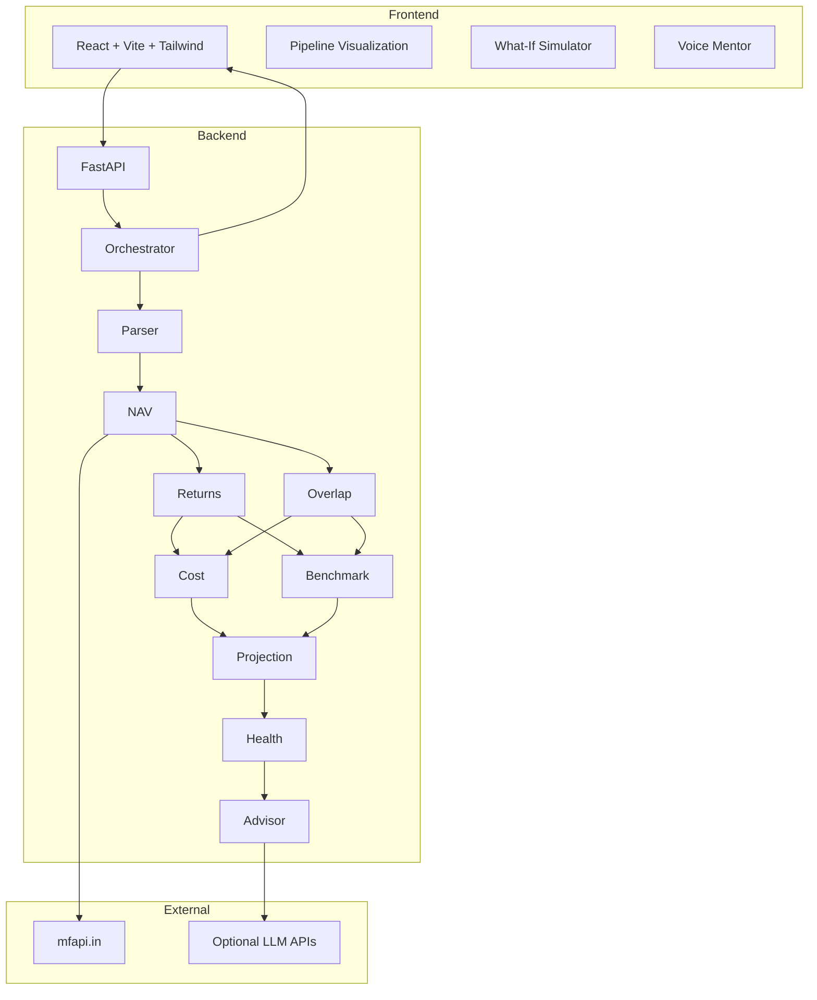

# ArthSaathi (अर्थसाथी) - AI Money Mentor

**ET GenAI Hackathon 2026 | Problem Statement 9**

ArthSaathi is an AI-powered financial intelligence platform that transforms a standard mutual fund CAS (Consolidated Account Statement) into a comprehensive, explainable, and actionable investment report within seconds.

The system combines deterministic financial computation with a real-time multi-agent AI pipeline to deliver accurate insights, full transparency, and intelligent recommendations for portfolio optimization.

---

## Demo

### Demo Video

*Add your demo video link here (YouTube / Drive / Loom)*

### Screenshots

*Add the following screenshots for best impact:*

* Portfolio Upload Screen
* Agent Pipeline Visualization
* Analysis Dashboard (XIRR, overlap, health score)
* What-If Simulation
* AI Mentor Chat

---

## Problem Statement

Retail investors often lack clarity about their investments. A typical CAS PDF contains large volumes of raw transactional data but provides no meaningful insights such as:

* Actual portfolio performance
* Hidden fund overlaps
* Long-term cost impact
* Benchmark comparisons
* Future wealth projections

Most existing tools are either opaque, slow, or overly dependent on black-box AI systems, leading to low trust and limited usability.

---

## Solution

ArthSaathi addresses these challenges by introducing a **transparent, computation-first financial analysis system** powered by a **real-time multi-agent pipeline**.

Instead of relying solely on large language models, the system performs all critical financial computations deterministically and uses AI only for interpretation and guidance. This ensures accuracy, reproducibility, and user trust.

The platform allows users to upload their CAS PDF and instantly receive:

* Verified performance metrics
* Structural portfolio insights
* Cost optimization strategies
* Future projections
* Personalized recommendations

All of this is streamed live through an interactive interface.

---

## Key Features

### 1. End-to-End Portfolio Analysis

ArthSaathi processes raw CAS data and computes accurate financial metrics such as XIRR using actual cash flows. The analysis operates at both the individual fund level and the overall portfolio level, ensuring a complete understanding of performance.

---

### 2. Fund Overlap and Diversification Analysis

The system evaluates holdings across funds to detect duplication and concentration risk. By identifying overlapping assets, users can avoid redundant investments and improve diversification efficiency.

---

### 3. Expense Drag and Cost Leakage Detection

Expense ratios are often overlooked but significantly impact long-term returns. ArthSaathi calculates the cumulative cost drag and quantifies how much wealth is lost over time due to fees. It also highlights opportunities for cost optimization.

---

### 4. Benchmark Comparison and Alpha Measurement

Each fund is mapped to its relevant benchmark index, allowing the system to evaluate whether the fund is outperforming or underperforming. This helps users identify ineffective investments and measure true alpha.

---

### 5. Long-Term Wealth Projection Engine

The platform simulates portfolio growth over a long-term horizon (e.g., 20 years) based on current performance and cost structure. It provides a visual representation of expected wealth accumulation and helps users align with financial goals.

---

### 6. Portfolio Health Score

A composite score (0–100) is generated using multiple dimensions:

* Diversification quality
* Cost efficiency
* Performance consistency
* Risk concentration

This score simplifies complex analysis into an easily interpretable metric.

---

### 7. Interactive What-If Simulation

Users can simulate changes such as switching from regular plans to direct plans. The system recalculates returns, costs, and projections instantly on the frontend, enabling real-time decision-making without additional API calls.

---

### 8. AI-Based Rebalancing Advisor

Based on computed insights, the system generates actionable recommendations including:

* Fund replacements
* Allocation adjustments
* Cost optimization strategies

These suggestions are grounded in deterministic analysis rather than generic AI outputs.

---

### 9. AI Mentor (Conversational Interface)

ArthSaathi includes an AI mentor that allows users to interact with their portfolio using natural language. The mentor supports multi-turn conversations and provides contextual explanations of financial insights.

---

### 10. Tax and Goal Planning Tools

Additional tools enhance financial planning:

* Tax harvesting recommendations
* Old vs new tax regime comparison
* Goal-based planning (retirement, education, etc.)

---

## System Architecture

The platform follows a modular architecture with a clear separation between frontend, backend, and external services.


---

## Multi-Agent Pipeline

The system is built on a nine-agent architecture, where each agent is responsible for a specific domain:

1. **Parser** : Extracts structured data from CAS PDF
2. **NAV** : Retrieves latest Net Asset Values
3. **Returns** : Computes XIRR and performance metrics
4. **Overlap** : Analyzes holdings overlap
5. **Cost** : Calculates expense ratios and drag
6. **Benchmark** : Performs index comparison
7. **Projection** : Simulates future wealth
8. **Health** : Computes portfolio score
9. **Advisor** : Generates actionable insights

---

## Technology Stack
### Backend

* Python 3.12
* FastAPI
* NumPy, pyxirr
* asyncio (parallel processing)
* Server-Sent Events (SSE)
* diskcache

### Frontend

* React 18
* TypeScript
* Tailwind CSS
* shadcn/ui
* @xyflow/react (graph visualization)
* Recharts

### Data Sources

* mfapi.in for NAV data
* Curated datasets for holdings, TER, and benchmarks

---

## Setup Instructions

### Prerequisites

* Python 3.11 or 3.12
* Node.js 18+
* pnpm

---

### Backend Setup

```bash
cd backend
python3.12 -m venv venv

# Activate environment
source venv/bin/activate  # Linux/Mac
# venv\Scripts\Activate.ps1  # Windows

pip install -r requirements.txt
python -m uvicorn app.main:app --host 0.0.0.0 --port 8000
```

Verify:

```
http://localhost:8000/api/health
```

Optional environment variables:

```
ANTHROPIC_API_KEY=
OPENAI_API_KEY=
GOOGLE_API_KEY=
```

---

### Frontend Setup

```bash
cd Frontend
pnpm install
pnpm dev
```

Open:

```
http://localhost:5173
```

---

## API Endpoints

| Method | Endpoint                | Description     |
| ------ | ----------------------- | --------------- |
| GET    | /api/health             | Health check    |
| POST   | /api/analyze            | Analyze CAS PDF |
| GET    | /api/analyze/test       | Sample analysis |
| POST   | /api/chat               | AI Mentor       |
| POST   | /api/goals/calculate    | Goal planning   |
| POST   | /api/tax/insights       | Tax insights    |
| POST   | /api/tax/regime-compare | Tax comparison  |
| POST   | /api/auth/register      | Register        |
| POST   | /api/auth/login         | Login           |

---

## Project Structure

```
backend/
  app/
    agents/
    orchestrator.py
    main.py

Frontend/
  src/
    components/
    pages/
    hooks/
    context/
```

---

## Key Design Decisions

### Computation-First Approach

All financial metrics are calculated using deterministic algorithms. This ensures reliability, auditability, and independence from external AI services.

### Multi-Agent Architecture

Breaking the system into specialized agents improves modularity, scalability, and parallel execution.

### Real-Time Streaming

Using SSE, users can observe each step of the pipeline, improving transparency and trust.

### Stateless Backend

The system processes input and returns output without persistent storage, simplifying deployment and scaling.

### Client-Side Simulation

Interactive simulations are performed on the frontend, ensuring instant feedback and improved user experience.

---

## Impact

ArthSaathi significantly improves the accessibility and usability of financial insights:

* Reduces analysis time from hours to seconds
* Identifies hidden inefficiencies in portfolios
* Enables data-driven investment decisions
* Improves financial literacy and transparency

---

## Documentation

* ARCHITECTURE.md - Detailed system design
* IMPACT_MODEL.md - Quantitative impact analysis

---

## Disclaimer

This project is intended for educational purposes and does not constitute financial advice.


